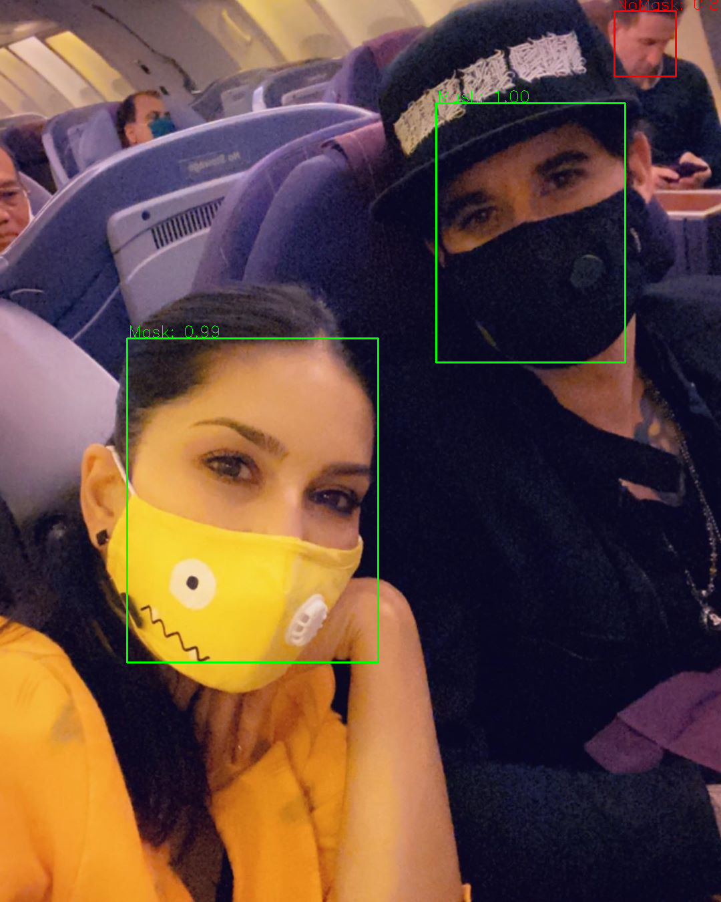

# Multi Face-mask detection using SSD

## Prerequisites :-

* [OpenCV]()
* [Tensorflow]()
* [Numpy]()

## Project Structure:-
   .
    ├── mask_detector                 # Contains all project files.
    ├    ├── images                   # Images used throughout project.
    ├    ├── load_model               # Helper function to Load face detection model and generate box with scores.
    ├    ├── model                    # Trained face detection model (face_mask_detection.pb)
    ├    ├── utils                    # Utility files used inside tensorflow_infer.py
    ├    ├── multicolor_mask.jpg      # Sample image to detect mask on image.           
    ├    ├── requirements.txt         # Required Libraries.
    ├    ├── tensorflow_infer.py      # Main code file.
    ├── Dockerfile               # Docker file to to form docker-image
    └── README.md                # Readme file
    
    
## Usage:-

### Through Python file:

Create virtualenv
```
Virtualenv venv
``` 
Install requirements from requirements.txt
```
pip install -r requirements.txt
```
Mask detection on image
```
python3 tensorflow_infer.py --img-model 1 --img-path multicolor_mask.jpg
```

Mask detection on video
```
python3 tensorflow_infer.py --img-model 0 --video-path 0
```

### Through Docker Image:

```
docker run python-ssd_multi_mask
```

### Taining data used

```
https://drive.google.com/file/d/1QspxOJMDf_rAWVV7AU_Nc0rjo1_EPEDW/view?usp=sharing
```

### Training architecture


    
